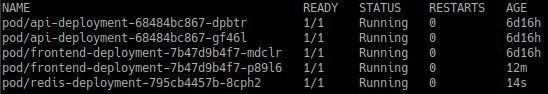

# CLD - Lab 06 : Kubernetes

## Task 1 - Deliverables

- Document any difficulties you faced and how you overcame them.

  - We didn't know at first how to assign a value for the endpoint of the localhost. By trying things out we managed to find a solution.

- Copy the object descriptions into the lab report.

  - Description of the Pods:

    - The screenshots below are the description of the Pod API. We make 3 screenshots to have bigger screenshots. This seperation has been done because we cannot edit the size of the image in a markdown document.

      

      

      

    - The screenshots below are the description of the Pod Redis.

      

      

      

    - The screenshots below are the description of the Pod Frontend.

      
    
      

      

  - Description of the Services:
  
    -  The screenshot below is the description of the service API.
  
      
  
    - The screenshot below is the description of the service Redis.
  
      
  
    - The screenshot below is the description of the service Kubernetes.
  
      

## Task 2 - Deliverables

- Document any difficulties you faced and how you overcame them.

  - The first difficulty was finding what was a target port and how to use it. Then we had to correctly map the ip addresses and ports of the different pods/services so that everything matches. We found the details in the download files about how to do it.
  - The second problem was connecting the pod to the service when creating it. It said the cluster had not enough nodes. We had to modify the default pool in the cluster details at the bottom of the page.
  - We couldn't connect to the frontend service so we had to increase the number of nodes again. We used the clusterIP instead of the load-balancer so this was also something wrong we did

- Copy the object descriptions into the lab report (if they are unchanged from the previous task just say so). 

  - Only the Pod Frontend has been modified. All other services/Pods are unchanged. The screenshots below show the new description of the Pod Frontend.

    

    

    

    
  
  - Description of the service Frontend. This service has been created during this task:
  
    
  
- Take a screenshot of the cluster details from the GKE console.

  - The screenshots below show the details from the GKE console. It is important to notice that the screenshots have been taken after we have done the task 3.

    

    

    

- Copy the output of the `kubectl describe` command to describe your load balancer once completely initialized.

  - It's located in the `svc-frontend`

    

## Task 3 - Deliverables

### Subtask 3.1

- Use only 1 instance for the Redis-Server. Why?
  
  - Redis is a master-slave architecture. The main Redis cache can set up muéltiple slaves to hold the data and act according to what the main instance would do. Since it seems we don't use a lot of data, we only have one instance of Redis server.
  
- Other observations/difficulties

  - The Kubernetes official documentation helped us a lot so we didn't encounter any difficulties

  - The Replica were all given IDs and they were created successfully

    kubectl get all

    

### Subtask 3.2

- What happens if you delete a Frontend or API Pod? How long does it take for the system to react?

  - It deletes successfully and another replaces it immediatly. It took 30 seconds to launch the new one.

  - Command was ```kubectl delete pod frontend-deployment-7b47d9b4f7-bwxmd```

    

    Before the delete

    

    While the Pod is recreating

    

    Running pods after the delete and recreation of the new Pod is complete

    

- What happens when you delete the Redis Pod?

  - It does the same as before but the creation of the new Redis Pod is much more faster. While after 30 seconds the pod was still being launch before, here after 14 seconds the new Redis Pod is already running

    

- How can you change the number of instances temporarily to 3? Hint: look for scaling in the deployment documentation

  - ```shell
    kubectl scale deployment.v1.apps/nginx-deployment --replicas=3
    ```

- What autoscaling features are available? Which metrics are used?

  - We can use [horizontal Pod autoscaling](https://kubernetes.io/docs/tasks/run-application/horizontal-pod-autoscale-walkthrough/) where we specify the minimum and maximum number of pods in our cluster and it is based on the CPU utilization of our existing Pods.

- How can you update a component? (see "Updating a Deployment" in the deployment documentation)

  - We can update what image a Deployment is using: ```kubectl --record deployment.apps/nginx-deployment set image deployment.v1.apps/nginx-deployment nginx=nginx:1.16.1```
    - Here we told the nginx Pod to use image 1.16.1 instead of the image it was using
  - We can also edit the Deployment and change the image manually by typing ```kubectl edit deployment.v1.apps/nginx-deployment```

### Other Deliverables

- Document any difficulties you faced and how you overcame them.
  - No particular difficulties
- Copy the object descriptions into the lab report.
  - Every other Pod/Service are the same as they were previously on Task 2
  - Otherwise the objects descriptions are in the report under Task 3.2